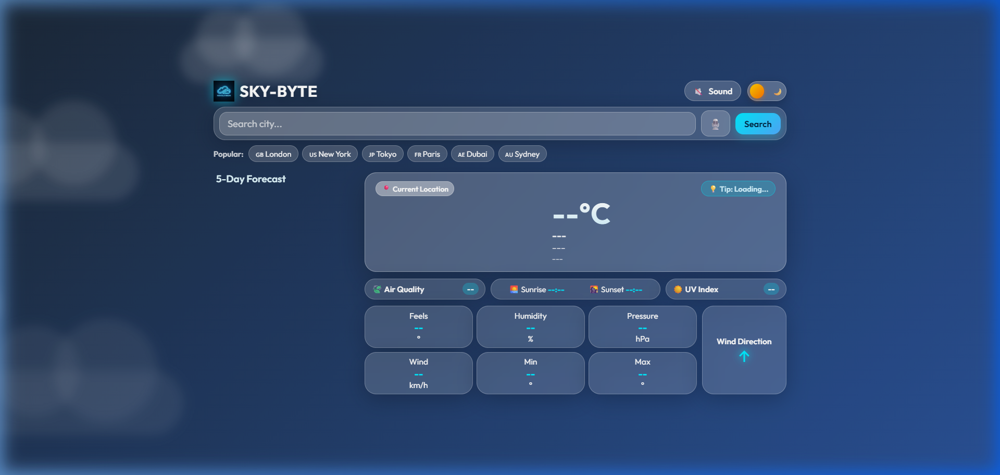
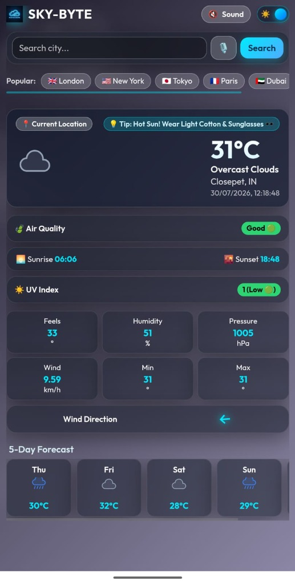

# 🌦️ SKY-BYTE | Next-Gen Interactive Weather Dashboard

<p align="center">
  
</p>

<p align="center">
  A premium, single-page <strong>Glassmorphism Weather Dashboard</strong> built with HTML5, CSS3, Vanilla JavaScript, HTML5 Canvas Physics, Web Audio API, and OpenWeather APIs.
</p>

<p align="center">
  
  
  
</p>
-
## 📸 Application Screenshots

### 💻 Desktop Dashboard Layout


### 📱 Responsive Mobile View


---

## 🌟 Key Features

- **💎 Modern Glassmorphism UI**: Ultra-clean backdrop blur cards, dark mode toggle, and single-screen dashboard layout.
- **🌤️ Dynamic Reactive Weather Backgrounds**:
  - ☀️ **Sunny / Clear**: Radiant pulsing sun glow and warm sky gradient.
  - 🌧️ **Rain & Drizzle**: High-performance HTML5 Canvas raindrop particle engine.
  - ⚡️ **Thunderstorm**: Flashing screen lightning overlay effect with storm cloud layers.
  - ❄️ **Snow**: Soft drifting snowfall canvas physics engine.
- **✨ Animated SVG Weather Icons**: Living micro-scene SVG weather icons with rotation, flashing lightning, rain animation, and drifting clouds.
- **🏷️ Quick Favorite City Chips**: One-click instant weather loading for top global cities (London, New York, Tokyo, Paris, Dubai, Sydney).
- **🎙️ AI Voice Search**: Integrated Web Speech API for hands-free voice city searching.
- **🔊 Generative Soundscape Audio**: Web Audio API procedural sound engine generating ambient rain noise and calming synth tones.
- **🔍 Smart Autocomplete**: Real-time city search suggestions using OpenWeather Direct Geocoding.
- **🍃 Live Air Quality Index (AQI)**: Color-coded air quality readings (Good 🟢, Moderate 🟠, Poor 🔴, Very Poor 🟣).
- **☀️ UV Index Estimator**: Real-time UV intensity indicators with safety status badges.
- **💡 Smart Outfit & Travel Advisor**: Real-time clothing recommendations based on temperature and weather conditions.
- **🌅 Sunrise & Sunset Tracker**: Local sunrise and sunset timings tailored to searched locations.

---

## 🛠️ Tech Stack

- **HTML5 & Semantic Markup**
- **CSS3 (Vanilla CSS, Glassmorphism, Keyframes & CSS Grid)**
- **JavaScript (ES6+)**
- **HTML5 Canvas (Particle Physics Engine)**
- **Web Audio API & Web Speech API**
- **OpenWeatherMap Weather, Geocoding & Air Pollution APIs**

---

## 📁 File Structure

```
SKYBYTE/
├── index.html           # Main dashboard structure & layout
├── style.css            # Glassmorphism design system & weather animations
├── app.js               # Core application logic, Voice API & Audio engine
├── weather-icons.js     # Animated SVG weather icons engine
├── logo.png             # SKY-BYTE brand logo & tab favicon
├── desktop_screenshot.png # Desktop dashboard preview
├── mobile_screenshot.png  # Mobile responsive dashboard preview
├── .env.example         # API key environment configuration template
├── .gitignore           # Secret protection rules
└── README.md            # Project documentation
```

---

## 🚀 Setup & Local Execution

1. **Clone the repository**:
   ```bash
   git clone https://github.com/yuriboiii20-art/SKY_BYTE.git
   cd SKY_BYTE
   ```

2. **Configure OpenWeather API Key**:
   - Copy `.env.example` to `.env`:
     ```bash
     cp .env.example .env
     ```
   - Add your OpenWeather API key inside `.env` or set `OWM_API_KEY` in `localStorage`.

3. **Run Locally**:
   - Open `index.html` directly in your browser, or serve via local static server:
     ```bash
     npx serve .
     ```

---

## 📝 License

Distributed under the MIT License.
